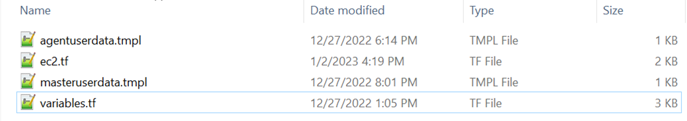
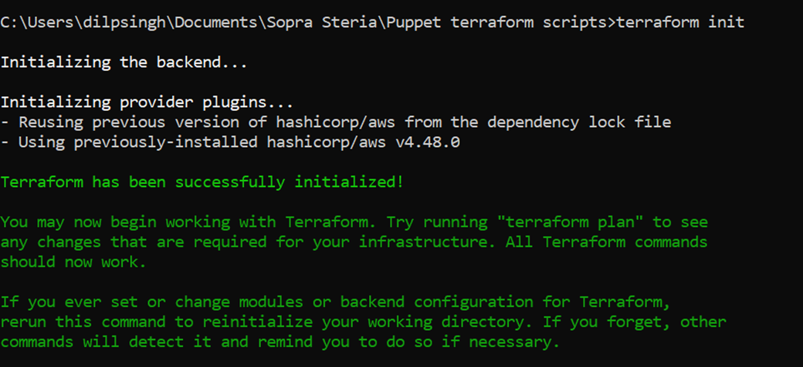
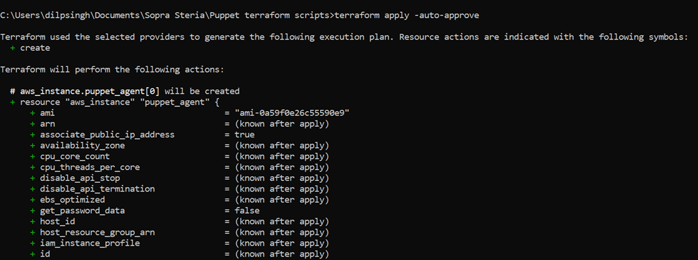
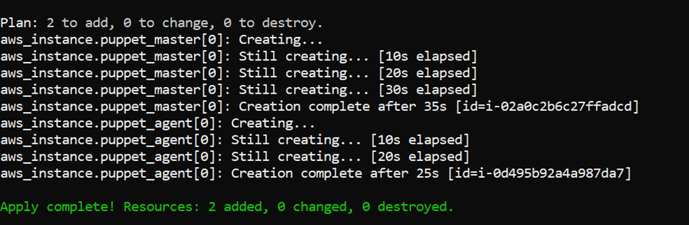
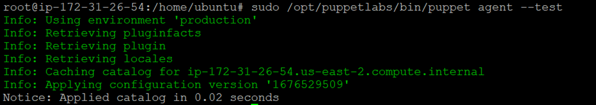

# **Puppet Accelerator**

Back to  [CCoE Home Page](https://innersource.soprasteria.com/group-cloud-coe/introduction/wikis/home)

Back to  [CCoE Introduction Page](https://innersource.soprasteria.com/group-cloud-coe/introduction)

# **Summary**
     
* **Purpose** : The Purpose of this accelerator is to automate the installation and configuration of puppet master and agent in Ubuntu and RHEL using terraform.
     
* __Owner__ : cloud.coe.india@soprasteria.com
* __Main contributors (multi-value)__ : vivek.srivastava@soprasteria.com, dilpreet.singh2@soprasteria.com
     
* __Group__ :  [Group Cloud CoE](https://innersource.soprasteria.com/group-cloud-coe/introduction/wikis/home)
     
* __Code quality automatically verified__ : N

* __Security automatically verified__ : N

* __Automatic unit testing__ : N

* __Automatic non regression test__ : N

* __Generic__ : N

* __Pipeline__ : N

* __Presentation documentation__ : 

* __User documentation__ :

# **Tools Used**
     
* __Terraform__ - Terraform is an infrastructure provisioning tool for building, changing, and versioning infrastructure safely and efficiently.

# **Pre-requisites**
     
* An AWS account with following access –
	                  **Amazon EC2,**
	                  **VPC, subnets, route tables**
    
* Terraform version installed v1.1.1 or greater and the setup of terraform should be done. Link to download and setup terraform-
            
   https://learn.hashicorp.com/terraform/getting-started/install.html
    
* AWS CLI should be installed and configured. Link to download and configure: -

   https://awscli.amazonaws.com/AWSCLIV2.msi

* **AWS VPC, subnets, and security groups** should be pre-configured.

* Necessary ports should be open in the security groups for ec2 instances.

    * __Puppet master__:
        
        * Respective inbound ports are 22 for SSH,

	    * 8140 for puppet agent to connect to puppet master instance,

	    * 443 for HTTPS,

	    * 80 for HTTP,
            
    * __Puppet agent__:
            
        * Respective inbound ports are 22 for SSH, 
	    
        * 443 for HTTPS,
	                 
        * 80 for HTTP

# __Configuration steps__
   
* Clone/download the code of this accelerator to create the puppet master and agent ec2 instances.
  
  https://innersource.soprasteria.com/group-cloud-coe/puppet-accelerator

* Unzip the downloaded zip file.

 
    - __ec2.tf__ - Creation of puppet agent and master instance which installs the agent and master prerequisites mentioned in the userdata template file.

    - __variables.tf__ - Contains variables to be called by resources in other files.

    - __agentuserdata.tmpl__ - Contains the puppet commands for agent.

    - __masteruserdata.tmpl__ - Contains the puppet commands for master.

* Change the necessary variables in **variables.tf** file to suit your requirements: 

    - **instance_master_type / instance_agent_type**: Mention the instance type of ec2 to specify ram, vcpu, memory. Default is: t2.micro

    -	**master_subnet_id / agent_subnet_id**: Mention the subnet id you want to create your instance in.

    -   **master_security_group_id / agent_security_group_id**: Mention the security group id you want to associate your instance with.

    - **associate_public_ip_address_master / associate_public_ip_address_agent**: Set to true if you want to access the instance publicly.

    -	**master_ami / agent_ami / region**: AMI’s are particular to a region which is by default set to us-east-2 i.e – Ohio. Change the ami according to the region you wish to create your instance in.

* Open cmd **(run as administrator)** and run the command: 

    - cd **<path_to_the_sourcecode_folder>**

* Run the following commands to setup the infrastructure: 

    - **terraform init**

     

    - **terraform apply -auto-approve**

     

     

* Login into the puppet-master instance using Putty and run the following command:

    - **sudo /opt/puppetlabs/bin/puppetserver ca sign --all**

* Login into the puppet-agent instance using Putty and run the following command:

    - **sudo /opt/puppetlabs/bin/puppet agent --test**

The below output confirms that puppet is successfully installed, and master and agent is adequately configured.
     
 

# **Contact**
- [CloudCoE -  Rajiv Singh](mailto:rajiv-kumar.singh@soprasteria.com)
- [SME - Vivek Srivastava , Dilpreet Singh](mailto:vivek.srivastava@soprasteria.com,dilpreet.singh2@soprasteria.com)

